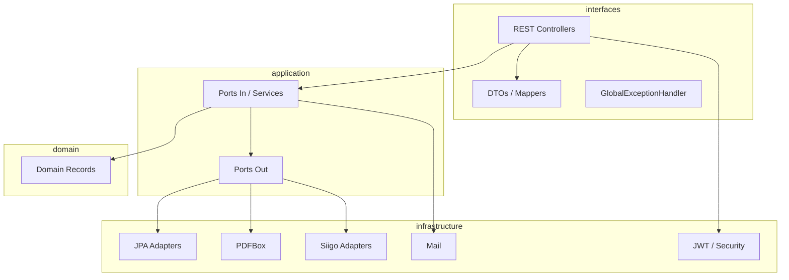

# C4 — Components (Backend)

```mermaid
flowchart TB
  subgraph interfaces
    CTRL[REST Controllers]
    DTO[DTOs / Mappers]
    EX[GlobalExceptionHandler]
  end
  subgraph application
    UC[Ports In / Services]
    OUT[Ports Out]
  end
  subgraph domain
    MODEL[Domain Records]
  end
  subgraph infrastructure
    JPA[JPA Adapters]
    SEC[JWT / Security]
    MAIL[Mail]
    PDF[PDFBox]
    SIIGO[Siigo Adapters]
  end
  CTRL --> UC
  CTRL --> DTO
  UC --> MODEL
  UC --> OUT
  OUT --> JPA
  OUT --> PDF
  OUT --> SIIGO
  CTRL --> SEC
  UC --> MAIL
```
