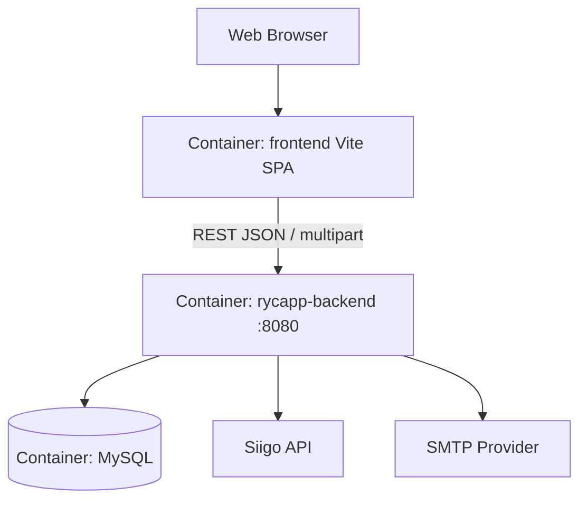

# C4 — Containers

```mermaid
flowchart TB
  Browser[Web Browser]
  SPA[Container: frontend Vite SPA]
  API[Container: rycapp-backend :8080]
  DB[(Container: MySQL)]
  Siigo[Siigo API]
  SMTP[SMTP Provider]
  Browser --> SPA
  SPA -->|REST JSON / multipart| API
  API --> DB
  API --> Siigo
  API --> SMTP
```
