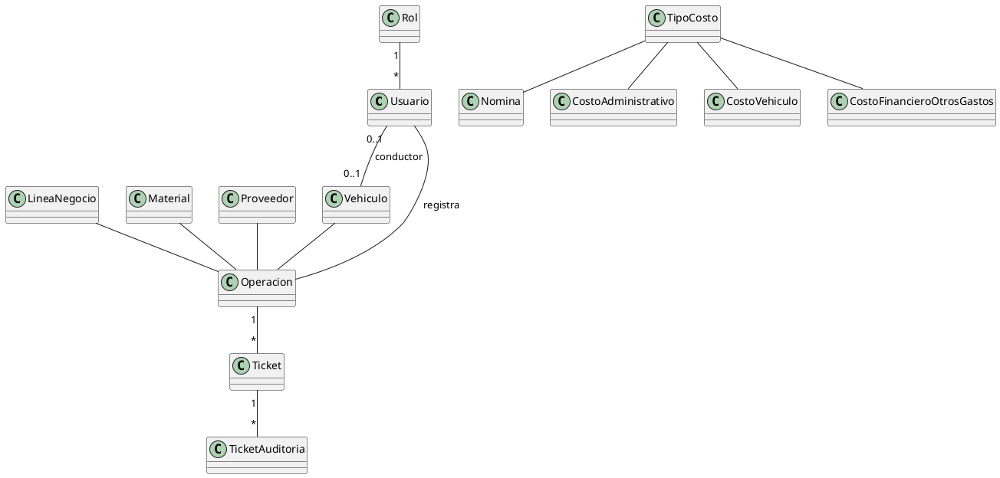

# Clases — dominio (PlantUML)

```plantuml
@startuml
skinparam classAttributeIconSize 0
class Usuario
class Rol
class Vehiculo
class LineaNegocio
class Material
class Proveedor
class TipoCosto
class Operacion
class Nomina
class CostoAdministrativo
class CostoVehiculo
class CostoFinancieroOtrosGastos
class Ticket
class TicketAuditoria
Rol "1" -- "*" Usuario
Usuario "0..1" -- "0..1" Vehiculo : conductor
Usuario -- Operacion : registra
LineaNegocio -- Operacion
Vehiculo -- Operacion
Material -- Operacion
Proveedor -- Operacion
Operacion "1" -- "*" Ticket
Ticket "1" -- "*" TicketAuditoria
TipoCosto -- Nomina
TipoCosto -- CostoAdministrativo
TipoCosto -- CostoVehiculo
TipoCosto -- CostoFinancieroOtrosGastos
@enduml
```
