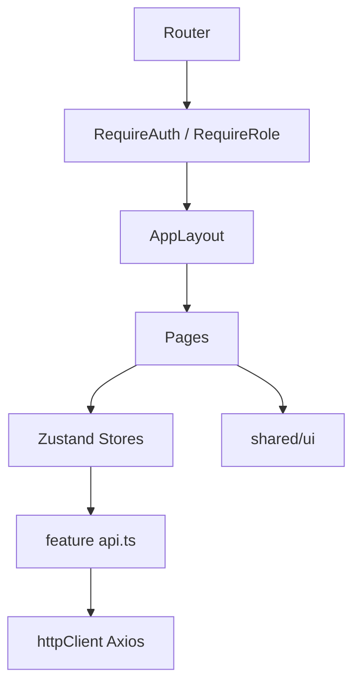

# Frontend — componentes

```mermaid
flowchart TB
  Router --> Guards[RequireAuth / RequireRole]
  Guards --> AppLayout
  AppLayout --> Pages
  Pages --> Stores[Zustand Stores]
  Stores --> APIs[feature api.ts]
  APIs --> HTTP[httpClient Axios]
  Pages --> SharedUI[shared/ui]
```
