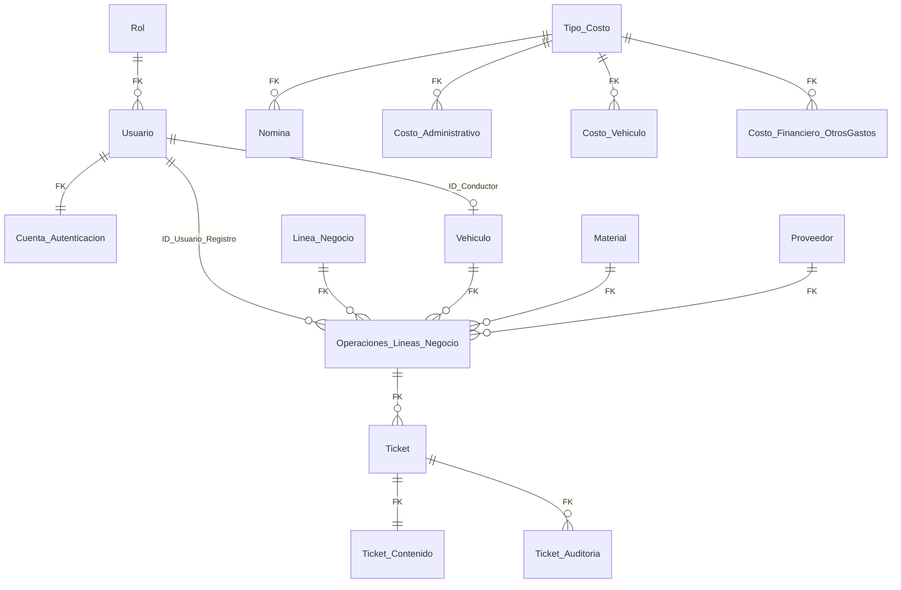

# ER (Mermaid)

```mermaid
erDiagram
  Rol ||--o{ Usuario : FK
  Usuario ||--|| Cuenta_Autenticacion : FK
  Usuario ||--o| Vehiculo : ID_Conductor
  Usuario ||--o{ Operaciones_Lineas_Negocio : ID_Usuario_Registro
  Linea_Negocio ||--o{ Operaciones_Lineas_Negocio : FK
  Vehiculo ||--o{ Operaciones_Lineas_Negocio : FK
  Material ||--o{ Operaciones_Lineas_Negocio : FK
  Proveedor ||--o{ Operaciones_Lineas_Negocio : FK
  Operaciones_Lineas_Negocio ||--o{ Ticket : FK
  Ticket ||--|| Ticket_Contenido : FK
  Ticket ||--o{ Ticket_Auditoria : FK
  Tipo_Costo ||--o{ Nomina : FK
  Tipo_Costo ||--o{ Costo_Administrativo : FK
  Tipo_Costo ||--o{ Costo_Vehiculo : FK
  Tipo_Costo ||--o{ Costo_Financiero_OtrosGastos : FK
```
