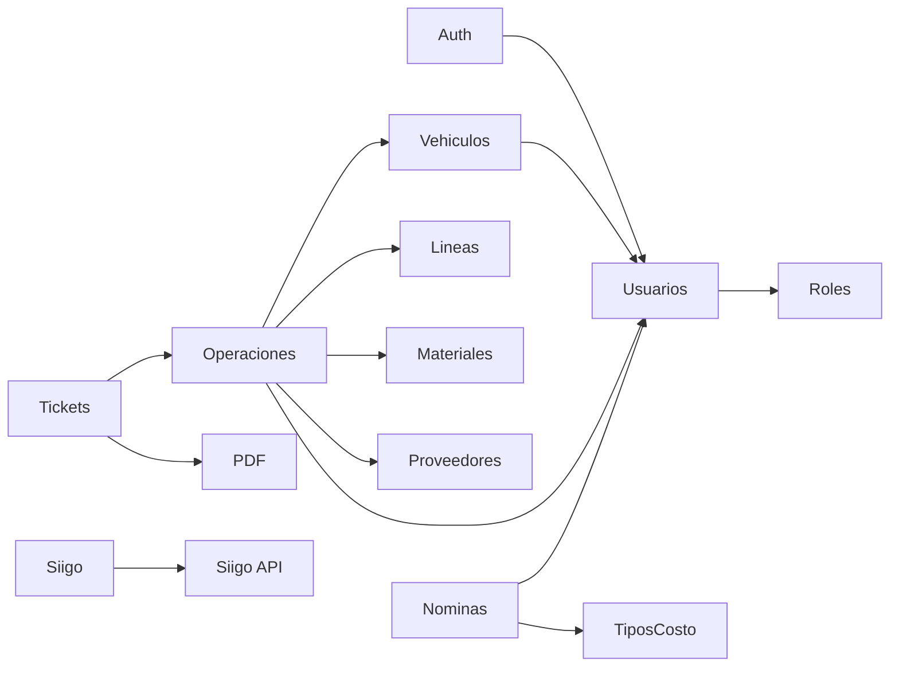

# Dependencias

```mermaid
flowchart LR
  Auth --> Usuarios
  Usuarios --> Roles
  Vehiculos --> Usuarios
  Operaciones --> Usuarios
  Operaciones --> Lineas
  Operaciones --> Vehiculos
  Operaciones --> Materiales
  Operaciones --> Proveedores
  Tickets --> Operaciones
  Tickets --> PDF
  Nominas --> TiposCosto
  Nominas --> Usuarios
  Siigo --> ExtSiigo[Siigo API]
```
