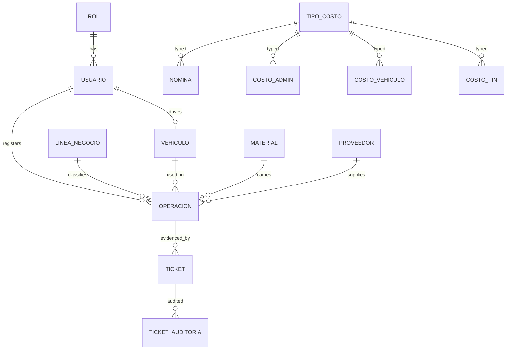

# Dominio

```mermaid
erDiagram
  ROL ||--o{ USUARIO : has
  USUARIO ||--o| VEHICULO : drives
  USUARIO ||--o{ OPERACION : registers
  LINEA_NEGOCIO ||--o{ OPERACION : classifies
  VEHICULO ||--o{ OPERACION : used_in
  MATERIAL ||--o{ OPERACION : carries
  PROVEEDOR ||--o{ OPERACION : supplies
  OPERACION ||--o{ TICKET : evidenced_by
  TICKET ||--o{ TICKET_AUDITORIA : audited
  TIPO_COSTO ||--o{ NOMINA : typed
  TIPO_COSTO ||--o{ COSTO_ADMIN : typed
  TIPO_COSTO ||--o{ COSTO_VEHICULO : typed
  TIPO_COSTO ||--o{ COSTO_FIN : typed
```
