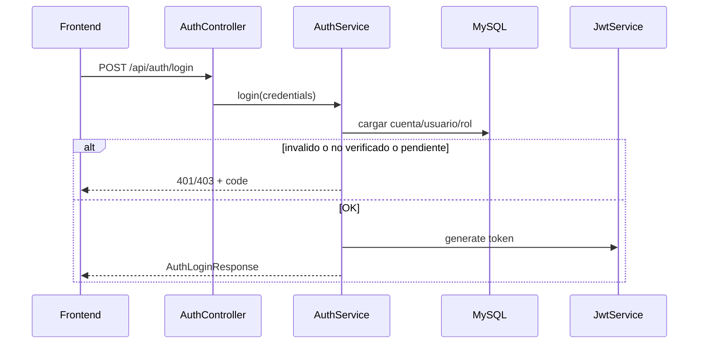

# Secuencia — Login

```mermaid
sequenceDiagram
  participant UI as Frontend
  participant AC as AuthController
  participant AS as AuthService
  participant DB as MySQL
  participant JWT as JwtService
  UI->>AC: POST /api/auth/login
  AC->>AS: login(credentials)
  AS->>DB: cargar cuenta/usuario/rol
  alt invalido o no verificado o pendiente
    AS-->>UI: 401/403 + code
  else OK
    AS->>JWT: generate token
    AS-->>UI: AuthLoginResponse
  end
```
