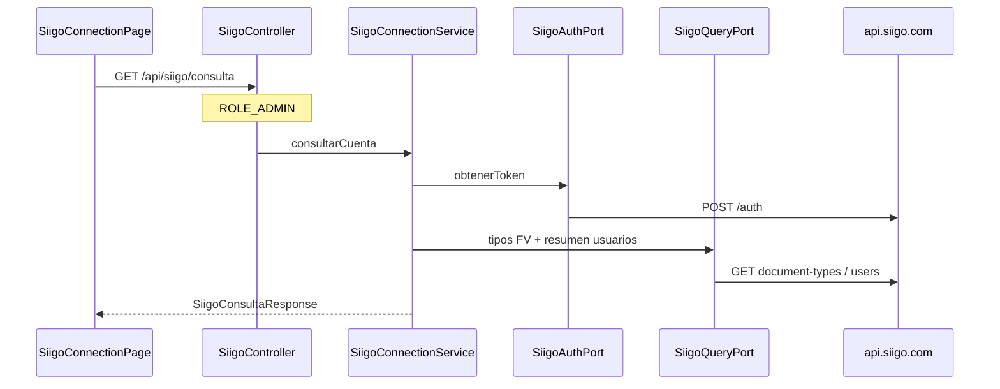

# Secuencia — Siigo consulta

```mermaid
sequenceDiagram
  participant UI as SiigoConnectionPage
  participant SC as SiigoController
  participant SS as SiigoConnectionService
  participant Auth as SiigoAuthPort
  participant Query as SiigoQueryPort
  participant Ext as api.siigo.com
  UI->>SC: GET /api/siigo/consulta
  Note over SC: ROLE_ADMIN
  SC->>SS: consultarCuenta
  SS->>Auth: obtenerToken
  Auth->>Ext: POST /auth
  SS->>Query: tipos FV + resumen usuarios
  Query->>Ext: GET document-types / users
  SS-->>UI: SiigoConsultaResponse
```
