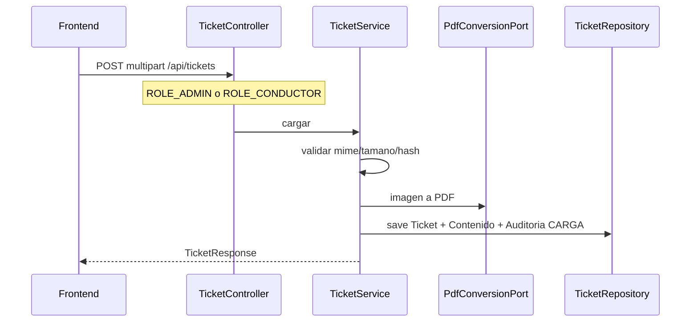

# Secuencia — Carga ticket

```mermaid
sequenceDiagram
  participant UI as Frontend
  participant TC as TicketController
  participant TS as TicketService
  participant PDF as PdfConversionPort
  participant TR as TicketRepository
  UI->>TC: POST multipart /api/tickets
  Note over TC: ROLE_ADMIN o ROLE_CONDUCTOR
  TC->>TS: cargar
  TS->>TS: validar mime/tamano/hash
  TS->>PDF: imagen a PDF
  TS->>TR: save Ticket + Contenido + Auditoria CARGA
  TS-->>UI: TicketResponse
```
