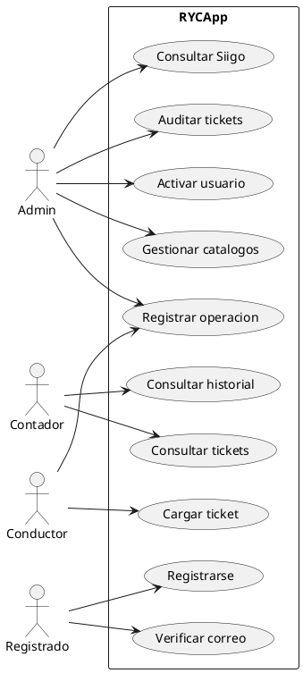

# Casos de uso (PlantUML)

```plantuml
@startuml
left to right direction
actor Admin
actor Contador
actor Conductor
actor Registrado
rectangle RYCApp {
  Registrado --> (Registrarse)
  Registrado --> (Verificar correo)
  Admin --> (Activar usuario)
  Admin --> (Gestionar catalogos)
  Admin --> (Consultar Siigo)
  Admin --> (Auditar tickets)
  Conductor --> (Cargar ticket)
  Contador --> (Consultar historial)
  Contador --> (Consultar tickets)
  Admin --> (Registrar operacion)
  Conductor --> (Registrar operacion)
}
@enduml
```
